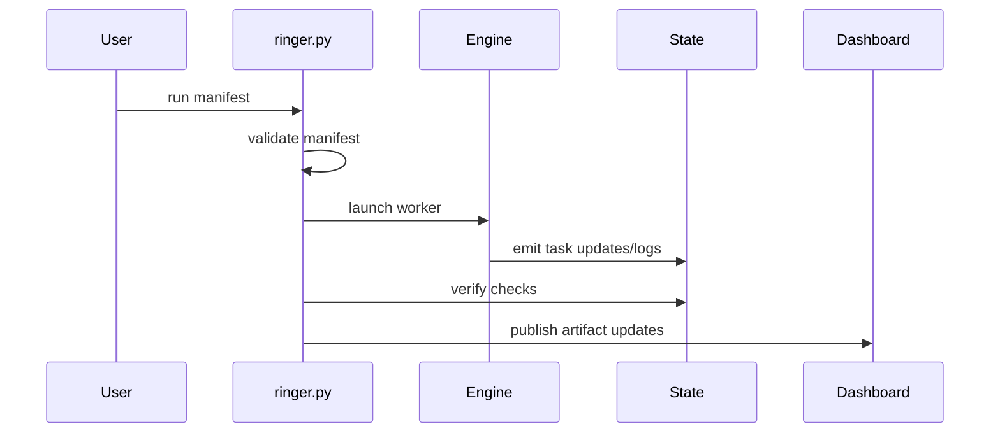

# Execution Core
Purpose: This page documents the top-level orchestration stack in the primary runner.

Active contributors: Jonathan Edwards

## Control plane
`ringer.py` is a monolithic CLI control plane containing:
- CLI argument parsing for run/lint/dashboard/db/models/catalog.
- Data classes for manifest/task/runtime types.
- Scheduling and worker orchestration.
- Active run tracking.

## Entry points
- Execution command: `./ringer.py run <manifest>`.
- Lint command: `./ringer.py lint <manifest>`.
- Dashboard command: `./ringer.py dashboard`.

## Key artifacts
- run-state JSON files
- logs
- task artifacts
- score payloads

## Sequence at high level

